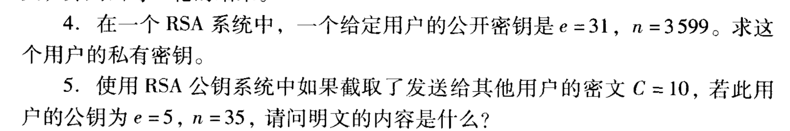
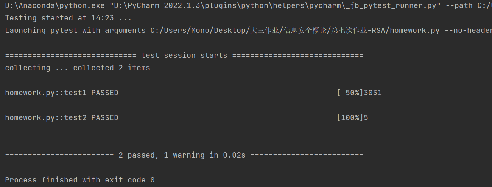

### 作业描述



### 代码实现

```python
from RSA import *
def test1():
    e = 31
    n = 3599
    factors = factor(n)
    OrLa = (factors[0] - 1)*(factors[1] - 1)
    d = mod_1(e, OrLa)
    print(d)
def test2():
    C = 10
    e = 5
    n = 35
    factors = factor(n)
    OrLa = (factors[0] - 1) * (factors[1] - 1)
    d = mod_1(e, OrLa)
    print(pow_mod(C, d, n))
if __name__ == "__main__":
    test1()
    test2()
```

### 测试结果

