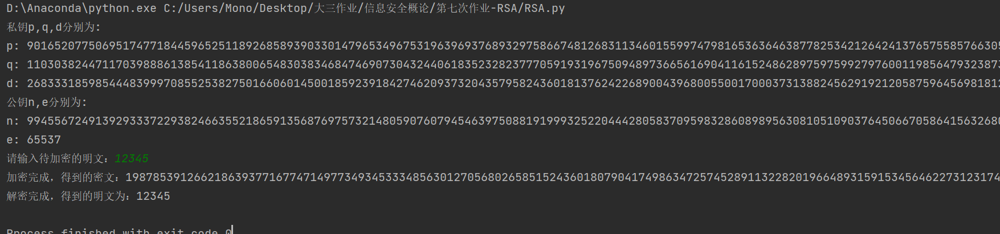
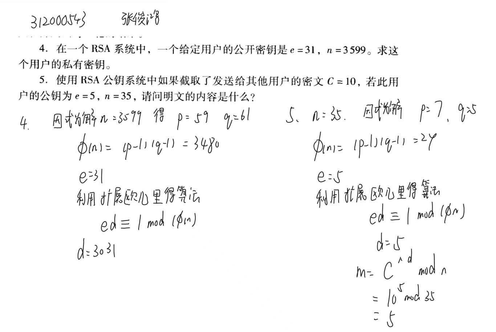

# RSA算法

### 算法描述

**算法介绍**

> **RSA加密算法**是一种[非对称加密算法](https://zh.wikipedia.org/wiki/非对称加密演算法)，在[公开密钥加密](https://zh.wikipedia.org/wiki/公开密钥加密)和[电子商业](https://zh.wikipedia.org/wiki/电子商业)中被广泛使用。
>
> 对极大整数做[因数分解](https://zh.wikipedia.org/wiki/因数分解)的难度决定了 RSA 算法的可靠性。换言之，对一极大整数做因数分解愈困难，RSA 算法愈可靠。假如有人找到一种快速因数分解的算法的话，那么用 RSA 加密的信息的可靠性就会极度下降。但找到这样的算法的可能性是非常小的。今天只有短的 RSA 钥匙才可能被强力方式破解。到2020年为止，世界上还没有任何可靠的攻击RSA算法的方式。只要其钥匙的长度足够长，用RSA加密的信息实际上是不能被破解的 from wikipedia

**算法流程**

1. 随机选择两个不相等的大质数p、q（512位一般较安全）
2. 计算p,q的乘积n
3. 计算n的欧拉函数$$\varphi(\mathrm{n})$$（欧拉函数是计算小于等于*n*的正整数中与*n*[互质](https://zh.wikipedia.org/wiki/互質)的数的数目）= (p-1)*(q-1)
4. 随机选择一个整数e，1 < e < $$\varphi(\mathrm{n})$$且e与$$\varphi(\mathrm{n})$$互质
5. 计算e对于$$\varphi(\mathrm{n})$$的模反元素d（即使得$$\text { ed } \equiv 1(\bmod \phi(n))$$成立，可以使用扩展欧几里得算法实现）
6. 封装公钥（n,e）私钥（n,d）

加密过程：
$$
m^{e} \equiv c(\bmod n)
$$


解密过程：
$$
c^{e} \equiv m(\bmod n)
$$


### 代码实现

```python
def pow_mod(p, q, n):
    '''
    幂模运算，快速计算(p^q) mod (n)
    这里采用了蒙哥马利算法
    '''
    res = 1
    while q:
        if q & 1:
            res = (res * p) % n
        q >>= 1
        p = (p * p) % n
    return res


def gcd(a, b):
    '''
    欧几里得算法求最大公约数
    '''
    while a != 0:
        a, b = b % a, a
    return b


def mod_1(x, n):
    '''
    扩展欧几里得算法求模逆
    取模负1的算法:计算x2= x^-1 (mod n)的值
    '''
    x0 = x
    y0 = n
    x1 = 0
    y1 = 1
    d = 1
    y2 = 0
    while n != 0:
        q = x // n
        (x, n) = (n, x % n)
        (x1, d) = ((d - (q * x1)), x1)
        (y1, y2) = ((y2 - (q * y1)), y1)
    if d < 0:
        d += y0
    if y2 < 0:
        y2 += x0
    return d


def probin(w):
    '''
    随机产生一个伪素数，产生 w表示希望产生位数
    '''
    list = []
    list.append('1')  # 最高位定为1
    for i in range(w - 2):
        c = random.choice(['0', '1'])
        list.append(c)
    list.append('1')  # 最低位定为1
    # print(list)
    res = int(''.join(list), 2)
    return res


def prime_miller_rabin(a, n):  # 检测n是否为素数
    '''
    第一步，模100以内的素数，初步排除很显然的合数
    '''
    list = (2, 3, 5, 7, 11, 13, 17, 19, 23, 29, 31, 37, 41
                 , 43, 47, 53, 59, 61, 67, 71, 73, 79, 83, 89, 97)  # 100以内的素数，初步排除很显然的合数
    for y in list:
        if n % y == 0:
            return False

    '''
    第二步 用miller_rabin素数判定算法对n进行检测
    '''
    if pow_mod(a, n - 1, n) == 1:  # 如果a^(n-1)!= 1 mod n, 说明为合数
        d = n - 1  # d=2^q*m, 求q和m
        q = 0
        while not (d & 1):  # 末尾是0
            q = q + 1
            d >>= 1
        m = d
        for i in range(q):  # 0~q-1, 我们先找到的最小的a^u，再逐步扩大到a^((n-1)/2)
            u = m * (2 ** i)  # u = 2^i * m
            tmp = pow_mod(a, u, n)
            if tmp == 1 or tmp == n - 1:
                # 满足条件
                return True
        return False
    else:
        return False


def prime_test(n, k):
    while k > 0:
        a = random.randint(2, n - 1)
        if not prime_miller_rabin(a, n):
            return False
        k = k - 1
    return True


# 产生一个大素数(bit位)
def get_prime(bit):
    while True:
        prime_number = probin(512)
        for i in range(50):  # 伪素数附近50个奇数都没有真素数的话，重新再产生一个伪素数
            u = prime_test(prime_number, 5)
            if u:
                break
            else:
                prime_number = prime_number + 2 * (i)
        if u:
            return prime_number
        else:
            continue

```


### 实验结果

加密12345



### 参考文献

RSA算法解释：

- http://www.ruanyifeng.com/blog/2013/06/rsa_algorithm_part_one.html
- http://www.ruanyifeng.com/blog/2013/07/rsa_algorithm_part_two.html
- https://saucer-man.com/cipher/83.html

扩展欧几里得算法

- https://zh.wikipedia.org/wiki/%E6%89%A9%E5%B1%95%E6%AC%A7%E5%87%A0%E9%87%8C%E5%BE%97%E7%AE%97%E6%B3%95

## 作业

