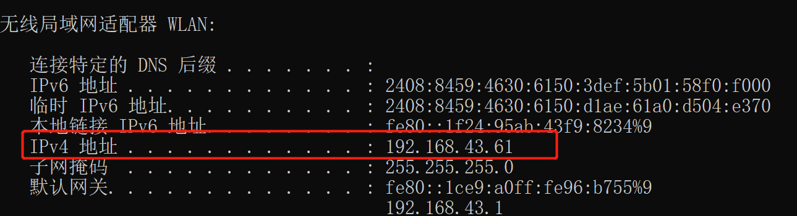
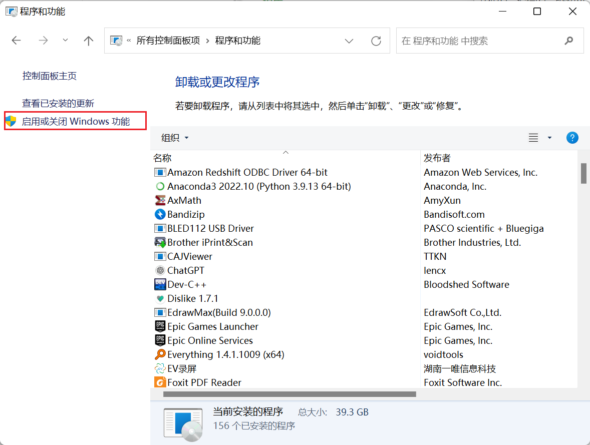

## 实验前提

本次实验都是基于win11环境以及同一局域网下的操作

主要参考群内叶臻强师兄的文档报告进行学习

服务器端ip

客户端ip

特点：操作方便，对于没有虚拟机条件的同学比较友好

## SSL

### 配置服务器

打开控制面板 -->程序和功能

启动或关闭Windows功能

找到Internet Infomation Services将原本没有勾选上的全部选上

进入如下界面，等待即可

搜索Internet Information Services (IIS)管理器打开

界面如下

右键网站-->添加网站

进入如下配置界面，物理路径可以任意，这里我放在作业目录下，IP地址选择本机局域网ip

在上述文件夹下创建一个基本的index.html可访问文件

修改index.html内容

继续配置网站权限，右键新建网站-->编辑权限

选择安全选项卡，点击编辑

添加Everyone对象

授予权限

测试：

使用本地局域网ip进入网址，可以访问到刚刚创建的index.html，说明网站配置成功

客户端也可以正常访问

### 未启用SSL情况下抓包

打开Wireshark，点击WLAN

输入客户端ip，设置过滤器

客户端访问服务器192.168.43.63,服务端使用wireshark抓包

如下，HTTP 200 OK的包中，可以发现没有使用SSL的情况下网络间的数据是赤裸的

### 为网站配置SSL证书

回到网站所在的根目录，找到服务器证书-->创建自签名证书

启动ssl服务

修改web.config文件

重新添加网站，选择https类型，添加刚刚创建的证书，将端口号设置为81

重新抓包

可以看到在https协议下，使用自签名证书则只会显示TCP握手协议，所以SSL证书必不可缺

## IPSEC

### Windows配置

- win+r打开命令板输入mmc打开控制台

- 点击文件，选择添加/删除管理单元

- 添加IP安全策略管理

- 右键创建IP安全策略

- 双击打开属性窗口

- 添加

点击下一步，不指定隧道，下一步，所有网络，下一步，添加ip筛选器

点击确定返回，勾选ip筛选器

进入下一页，点击添加筛选器操作

选择协商安全，下一步增加身份验证方法，输入3120005043，并进行指派

检测网络

网络连通

抓包

- 使用ESP加密且认证

重新访问

- 采用ESP，只认证

## PKI

- 安装
- 配置环境变量
- 测试安装成功

列出可用的ECC曲线`openssl ecparam -list_curves`

我使用prime256v1生成ECC秘钥对，使用ECC key生成CA证书

首先生成CA ECC密钥 

`openssl ecparam -out private/ec-cakey.pem -name prime256v1 -genkey`

`openssl ecparam -in private/ec-cakey.pem -text -noout`

然后生成CA证书

`openssl req -new -x509 -days 3650 -config openssl.cnf -extensions v3_ca -key private/ec-cakey.pem -out cert/ec-cacert.pem`

验证CA证书内容及使用的签名算法

`openssl x509 -noout -text -in cert/ec-cacert.pem`

验证CA证书

- 使用私钥验证CA证书
- 从私钥导出公钥

可以看到两种方式的公钥相同

#### 使用CA私钥和证书签发服务端证书

- 生成ECC私钥`openssl ecparam -out server.key -name prime256v1 -genkey`
- 生成CSR请求`openssl req -new -key server.key -out server.csr -sha256`

- 使用ECC私钥及CA证书，对server.csr签名，生成服务端证书

`openssl ca -keyfile ../private/ec-cakey.pem -cert ../cert/ec-cacert.pem -in server.csr -out server.crt -config ../openssl.cnf`

验证证书是否有效时使用CA证书

验证index.txt

