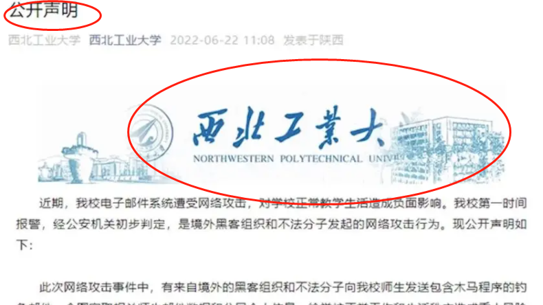
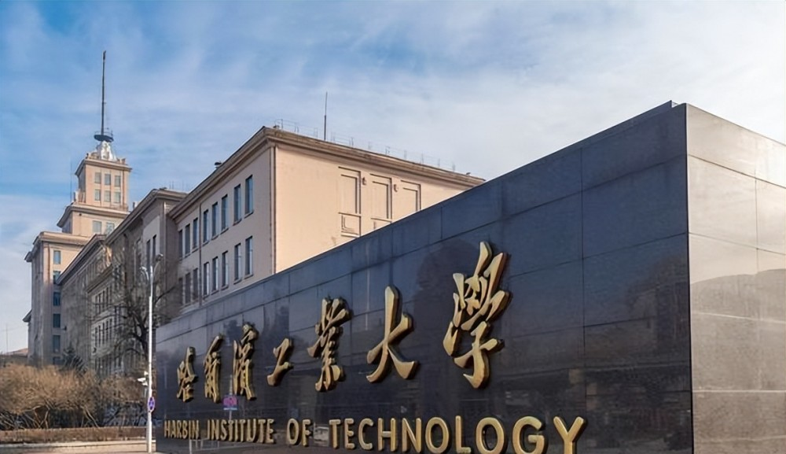
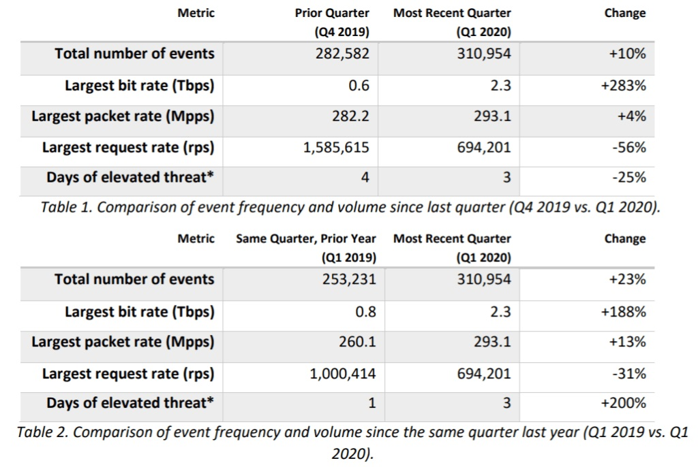

# 安全事件搜索

## 西北工业大学遭美网络攻击

​	9月5日，国家计算机病毒应急处理中心和360公司分别发布了关于西北工业大学遭受美国国家安全局网络攻击的调查报告，美国国家安全局(NSA)下属的特定入侵行动办公室(TAO)使用了40余种不同的专属网络攻击武器，持续对西北工业大学开展攻击窃密，窃取该校关键网络设备配置、网管数据、运维数据等核心技术数据。

​	作为拥有最强大网络技术实力的国家，美国以“国家利益”为幌子，违反国际法和国际关系基本准则，无视基本道德信义，对他国实施大规模网络窃密与监听监控，严重损害他国国家安全和公民个人信息安全。“网络霸凌”大国的种种行径，暴露了美国才是全球网络空间不安全的罪魁祸首。

​	**以假邮件“钓鱼”，美国使用41种网络武器攻击西工大**

网站链接：[西工大遭境外黑客攻击，学生连夜“反击”，网友：耗子掉进了猫窝_腾讯新闻 (qq.com)](https://new.qq.com/rain/a/20220625A0549400)

## 亚马逊抵御有史以来最大的DDoS攻击

​	6月18日消息 亚马逊AWS近日宣布，它已经减缓了2.3 Tbps的DDoS攻击，这是有史以来最大的攻击，超过了2018年3月所记载的1.7 Tbps的记录。

​	此次攻击发生在今年2月中旬，亚马逊 AWS 盾服务成功抵御了这 2.3 Tbps 攻击。

​	此次网络攻击的整个过程被记录在亚马逊AWS威胁报告中，该报告详细记录了由亚马逊AWS盾保护服务所遭受的的网络攻击。但该报告并没有说明此次 DDoS 攻击的目标，AWS 专家只透露，该强度是依赖 CLDAP 攻击反馈获得的。

​	IT之家了解到，无连接轻量级目录访问协议(CLDAP)是微软LDAP协议的替代方案。该协议用于连接、搜索和修改共享的internet目录，一个CLDAP DDoS可以将流量放大到其容量的70倍。

​	该报告称，大多数 DDoS 攻击是较小的攻击，2020 年第 1 季度有99 %的攻击强度仅有约 43 Gbps大小。

​	该报告总结道："自2019年Q1以来，探测到的攻击事件次数增加了23%。这是由web应用层事件数量的增加所引起的。“

