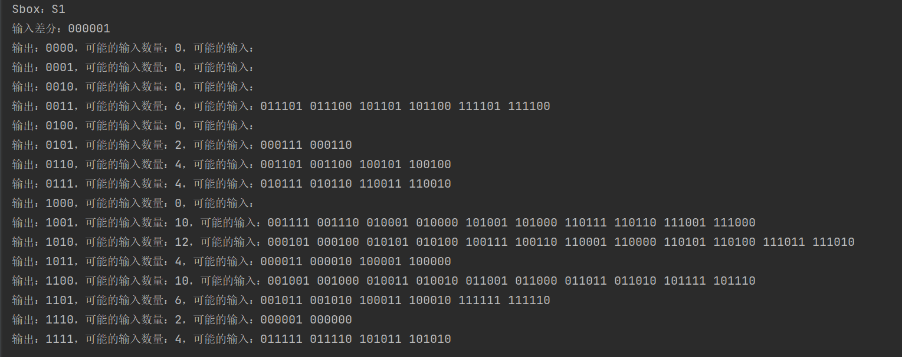
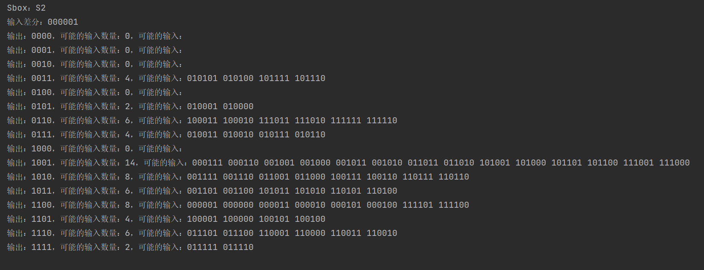
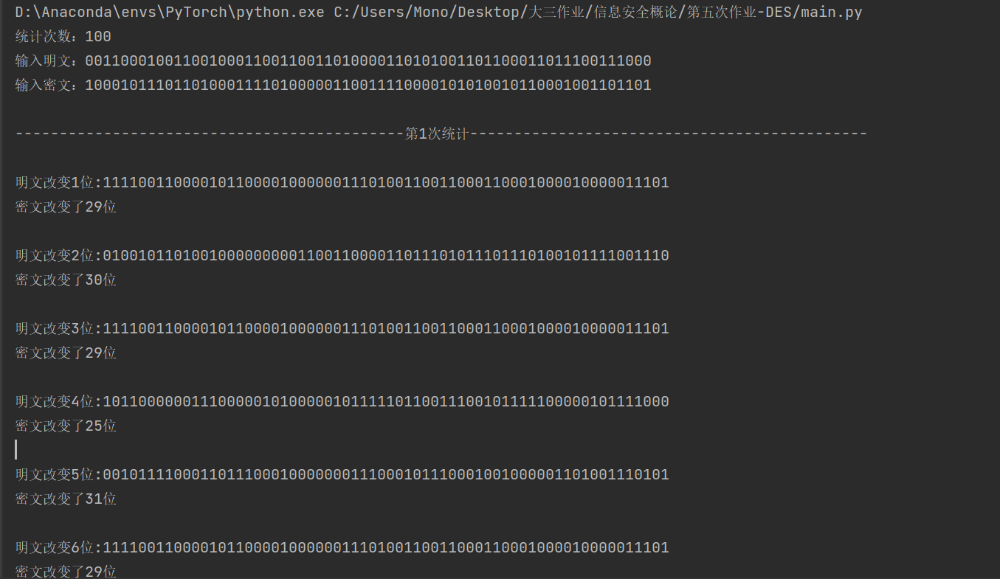
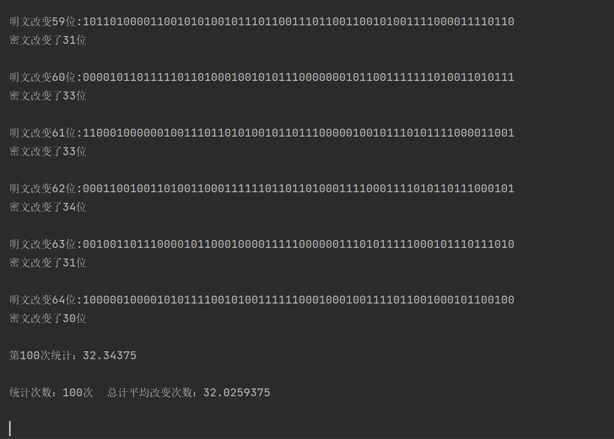
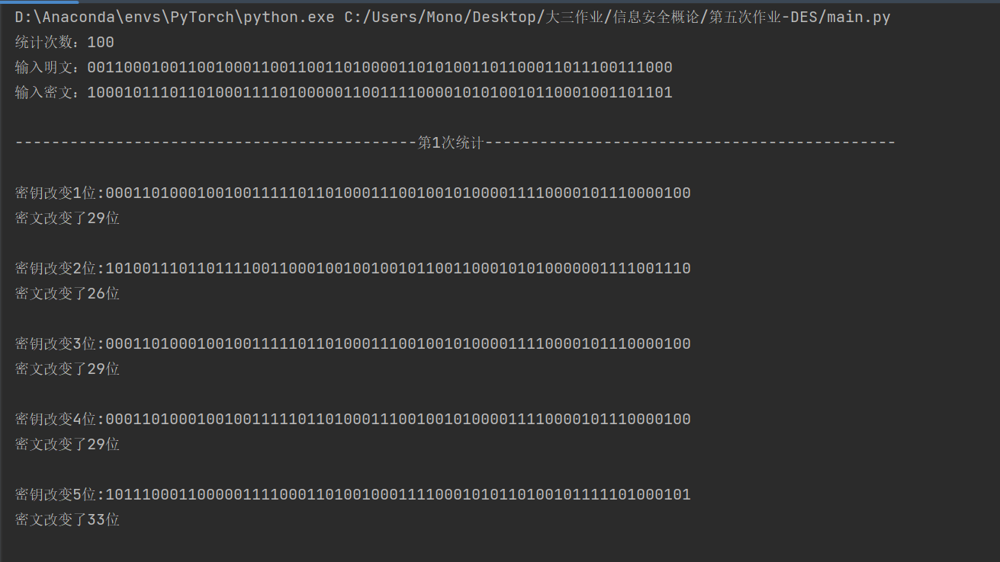
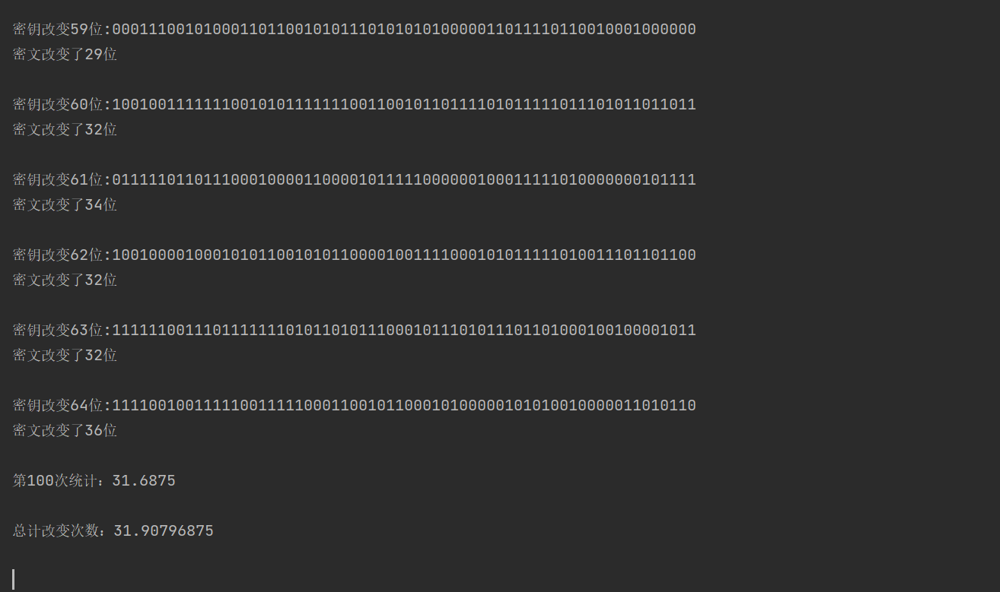

# DES算法

实现功能：

1. 给定某个Sbox的输入差分情况下，计算所有对和所有Sbox输出差分的分布情况
2. 统计DES算法在密钥固定情况，输入明文改变1位、2位。。。64位。输出密文位数改变情况
3. 统计DES算法在明文固定情况，输入密钥改变1位、2位。。。64位。输出密文位数改变情况
4. 实现对2 3算法的多次统计取平均

## 代码

本算法参考了github开源库pyDeshttps://github.com/twhiteman/pyDes

经过学习发现该库实现了DES的加密解密功能，故本项目基于python实现

## 功能一

实现的功能：给定某个Sbox的输入差分情况下，计算所有对和所有Sbox输出差分的分布情况

#### 代码如下：

```python
    def distribution(cmb = 'S1', mentry = '000001'):
        """
        获取输入差分以及输入的Sbox
        """
        b = ''
        d = ''
        a = []
        c = []
        gg = [[], [], [], [], [], [], [], [], [], [], [], [], [], [], [], []]
        getfunction = cmb
        getzhi = mentry
        for i in range(64):
            b += str(functions(str('{:06b}'.format(i)), getfunction))
            d += str(functions(str(codeyihuo('{:06b}'.format(i), str(getzhi))), getfunction))
            a.append(str(codeyihuo(b[i * 4:i * 4 + 4], d[i * 4:i * 4 + 4])))
            gg[int(str(codeyihuo(b[i * 4:i * 4 + 4], d[i * 4:i * 4 + 4])), 2)].append(
                str(codeyihuo('{:06b}'.format(i), str(getzhi))))
        for pi in range(len(gg)):
            g3 = ''
            g1 = str('{:04b}'.format(pi))
            g2 = str(len(gg[pi]))
            for btg in gg[pi]:
                g3 += str(btg) + str(' ')
            print("输出：{}，可能的输入数量：{}，可能的输入：{}".format(g1, g2, str(g3)))
```

Sbox

```
S1 = [[14, 4, 13, 1, 2, 15, 11, 8, 3, 10, 6, 12, 5, 9, 0, 7],
          [0, 15, 7, 4, 14, 2, 13, 1, 10, 6, 12, 11, 9, 5, 3, 8],
          [4, 1, 14, 8, 13, 6, 2, 11, 15, 12, 9, 7, 3, 10, 5, 0],
          [15, 12, 8, 2, 4, 9, 1, 7, 5, 11, 3, 14, 10, 0, 6, 13]]
    S2 = [[15, 1, 8, 14, 6, 11, 3, 4, 9, 7, 2, 13, 12, 0, 5, 10],
          [3, 13, 4, 7, 15, 2, 8, 14, 12, 0, 1, 10, 6, 9, 11, 5],
          [0, 14, 7, 11, 10, 4, 13, 1, 5, 8, 12, 6, 9, 3, 2, 15],
          [13, 8, 10, 1, 3, 15, 4, 2, 11, 6, 7, 12, 0, 5, 14, 9]]
    S3 = [[10, 0, 9, 14, 6, 3, 15, 5, 1, 13, 12, 7, 11, 4, 2, 8],
          [13, 7, 0, 9, 3, 4, 6, 10, 2, 8, 5, 14, 12, 11, 15, 1],
          [13, 6, 4, 9, 8, 15, 3, 0, 11, 1, 2, 12, 5, 10, 14, 7],
          [1, 10, 13, 0, 6, 9, 8, 7, 4, 15, 14, 3, 11, 5, 2, 12]]
    S4 = [[7, 13, 14, 3, 0, 6, 9, 10, 1, 2, 8, 5, 11, 12, 4, 15],
          [13, 8, 11, 5, 6, 15, 0, 3, 4, 7, 2, 12, 1, 10, 14, 9],
          [10, 6, 9, 0, 12, 11, 7, 13, 15, 1, 3, 14, 5, 2, 8, 4],
          [3, 15, 0, 6, 10, 1, 13, 8, 9, 4, 5, 11, 12, 7, 2, 14]]
    S5 = [[2, 12, 4, 1, 7, 10, 11, 6, 8, 5, 3, 15, 13, 0, 14, 9],
          [14, 11, 2, 12, 4, 7, 13, 1, 5, 0, 15, 10, 3, 9, 8, 6],
          [4, 2, 1, 11, 10, 13, 7, 8, 15, 9, 12, 5, 6, 3, 0, 14],
          [11, 8, 12, 7, 1, 14, 2, 13, 6, 15, 0, 9, 10, 4, 5, 3]]
    S6 = [[12, 1, 10, 15, 9, 2, 6, 8, 0, 13, 3, 4, 14, 7, 5, 11],
          [10, 15, 4, 2, 7, 12, 9, 5, 6, 1, 13, 14, 0, 11, 3, 8],
          [9, 14, 15, 5, 2, 8, 12, 3, 7, 0, 4, 10, 1, 13, 11, 6],
          [4, 3, 2, 12, 9, 5, 15, 10, 11, 14, 1, 7, 6, 0, 8, 13]]
    S7 = [[4, 11, 2, 14, 15, 0, 8, 13, 3, 12, 9, 7, 5, 10, 6, 1],
          [13, 0, 11, 7, 4, 9, 1, 10, 14, 3, 5, 12, 2, 15, 8, 6],
          [1, 4, 11, 13, 12, 3, 7, 14, 10, 15, 6, 8, 0, 5, 9, 2],
          [6, 11, 13, 8, 1, 4, 10, 7, 9, 5, 0, 15, 14, 2, 3, 12]]
    S8 = [[13, 2, 8, 4, 6, 15, 11, 1, 10, 9, 3, 14, 5, 0, 12, 7],
          [1, 15, 13, 8, 10, 3, 7, 4, 12, 5, 6, 11, 0, 14, 9, 2],
          [7, 11, 4, 1, 9, 12, 14, 2, 0, 6, 10, 13, 15, 3, 5, 8],
          [2, 1, 14, 7, 4, 10, 8, 13, 15, 12, 9, 0, 3, 5, 6, 11]]
```

#### 测试过程

1. Sbox为第一个盒子时：



2. Sbox为第二个盒子时：



## 功能二

实现的功能：统计DES算法在密钥固定情况，输入明文改变1位、2位。。。64位。输出密文位数改变情况

#### 代码如下：

```python
def from_codetocode(key, code, time):
    des = DES()
    allavg = 0
    for alltime in range(time):
        avg = 0
        print("\n--------------------------------------------第" + str(
            alltime + 1) + "次统计---------------------------------------------\n")
        for i in range(64):
            change = 0
            changecode = encrypt(des.changekey(key, i), code)
            print("明文改变" + str(i + 1) + '位:' + str(changecode))
            for a in range(64):
                if changecode[a] != code[a]:
                    change += 1
                    print('密文改变了' + str(change) + '位\n')
                    avg += change
                    avg = avg / 64
                    print('第' + str(alltime + 1) + '次统计：' + str(avg) + '\n')
                    allavg += avg
                    alla = allavg / time
                    print('统计次数：100次  总计平均改变次数：' + str(alla) + '\n')
```

#### 测试过程：

经过100次统计得到输入明文改变1位、2位。。。64位。输出密文位数平均改变32.0次





## 功能三

实现的功能：统计DES算法在明文固定情况，输入密钥改变1位、2位。。。64位。输出密文位数改变情况

#### 代码如下：

```python
def keytocode(key, code, time):
    des = DES()
    allavg = 0
    for alltime in range(time):
        avg = 0
        print("\n--------------------------------------------第" + str(
            alltime + 1) + "次统计---------------------------------------------\n")
        for i in range(64):
            change = 0
            changecode = encrypt(code, des.changekey(key, i))
            print("密钥改变" + str(i + 1) + '位:' + str(changecode))
            for a in range(64):
                if changecode[a] != code[a]:
                    change += 1
                    print('密文改变了' + str(change) + '位\n')
                    avg += change
                    avg = avg / 64
                    print('第' + str(alltime + 1) + '次统计：' + str(avg) + '\n')
                    allavg += avg
                    alla = allavg / time
                    print('总计改变次数：' + str(alla) + '\n')
```


#### 测试过程：

经过100次统计得到输入密钥改变1位、2位。。。64位。输出密文位数平均改变31.9次



