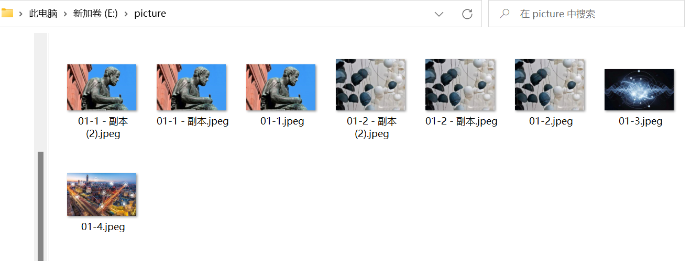
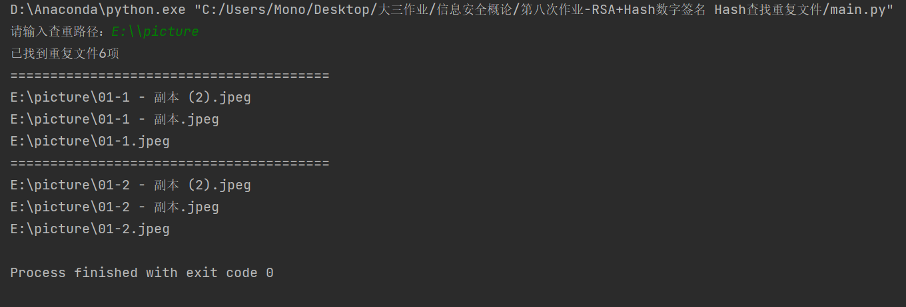
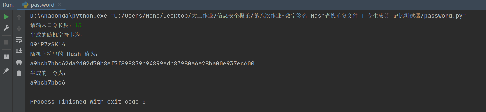
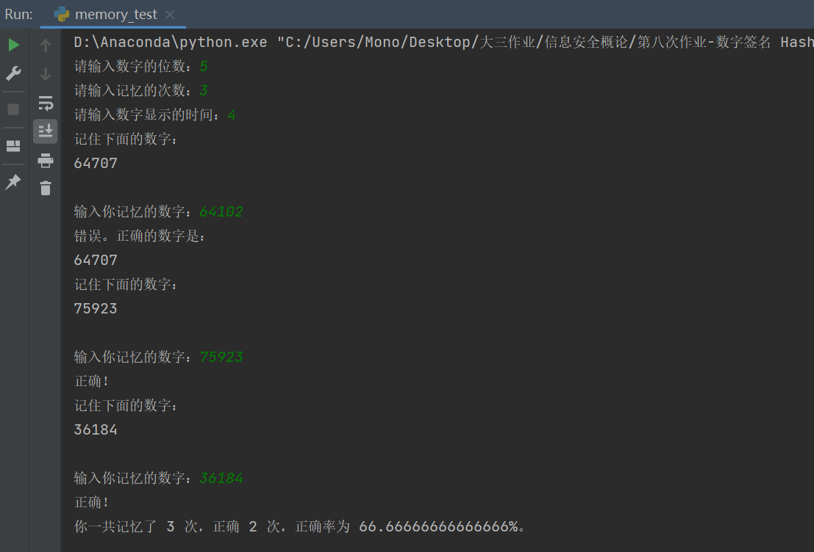

# RSA、Hash实现数字签名和验证

参考教程：https://www.liaoxuefeng.com/wiki/1252599548343744/1304227943022626

使用数字签名的目的是为了确认某个信息确实是由某个发送方发送的，任何人都不可能伪造消息，并且，发送方也不能抵赖。

## 文件描述

- RSA.py：封装了数字签名和验证
- test.py：测试类

## 测试验证

```python
Alice = RSACipher('Alice')
Bob = RSACipher('Bob')
Nancy = RSACipher('Nancy')

messages = 'hello world!'
# 私钥签名
Alice.sign(messages)
# 测试使用收到的公钥进行解密
Bob.check(messages, Alice, Alice.crypto)
# 测试使用错误的公钥进行解密
Nancy.check(messages, Bob, Alice.crypto)
```

分别测试使用和不使用Alice的公钥对签名进行验证

结果如下：

```
Alice签名成功！
Bob验证签名成功！消息来自Alice
Nancy验证失败，消息被破坏...
```

# 利用Hash函数查找本地硬盘重复文件

## 算法原理

基于python中的`hashlib`的md5加密算法读取文件内容更新hash值，如果文件内容相同则hash值相同

算法步骤：

1. 使用md5算法获得文件夹中每个文件的hash值
2. 将hash值作为key，文件存储路径作为value进行存储
3. 输出字典中相同key但是value大于1的所有文件

## 文件描述

- find_duplicate_file.py：利用hash函数查找重复文件

## 关键代码

```python
def md5sum(filename, blocksize=65536):
    hash = hashlib.md5()
    with open(filename, "rb") as f:
        for block in iter(lambda: f.read(blocksize), b""):
            hash.update(block)
    return hash.hexdigest()


def build_dup_dict(dir_path, pattern='*.jpeg'):
    def save(file):
        hash = md5sum(file)
        if hash not in dup.keys():
            dup[hash] = [file]
        else:
            dup[hash].append(file)

    p = Path(dir_path)
    for item in p.glob('**/' + pattern):
        save(str(item))
```


## 实验测试





算法正确查找到重复的6个图片文件并进行分类输出

# 口令生成器

## 算法原理

使用python的hashlib中sha256加密算法生成一个随机字符串的摘要信息

根据用户需要的口令长度截取前n位输出

## 文件描述

- password.py：口令生成器

## 主要代码

```python
import hashlib
import random

# 询问用户口令长度
pwd_length = int(input("请输入口令长度："))

# 生成随机字符串
random_str = ''.join(random.sample('abcdefghijklmnopqrstuvwxyzABCDEFGHIJKLMNOPQRSTUVWXYZ0123456789!@#$%^&*', pwd_length))
print("生成的随机字符串为：")
print(random_str)

# 计算随机字符串的 Hash 值
random_str_hash = hashlib.sha256(random_str.encode()).hexdigest()
print("随机字符串的 Hash 值为：")
print(random_str_hash)

# 将 Hash 值作为口令
pwd = random_str_hash[:pwd_length]
print("生成的口令为：")
print(pwd)
```

## 实验测试



# 记忆测试器

## 算法原理

使用python的random库根据用户要记忆的位数生成随机数

可以设定记忆的间隔时间以及记忆的次数

系统会返回记忆的正确率，总次数，正确次数等信息

## 文件描述

- memory_test.py：记忆测试器

## 主要代码

```python
import random
import time

# 询问用户数字的位数
num_digits = int(input("请输入数字的位数："))

# 生成指定位数的随机数
random_number = random.randint(10**(num_digits-1), 10**num_digits-1)

# 询问用户输入次数
num_inputs = int(input("请输入记忆的次数："))
interval = int(input("请输入数字显示的时间："))

# 统计正确次数
num_correct = 0

# 多次询问用户输入记忆的数字
for i in range(num_inputs):
    random_number = random.randint(10 ** (num_digits - 1), 10 ** num_digits - 1)
    # 显示随机数
    print("记住下面的数字：")
    print(random_number)

    # 等待 5 秒钟，让用户记忆数字
    time.sleep(interval)

    # 清屏
    print("\033[2J")

    # 询问用户输入记忆的数字
    user_input = int(input("输入你记忆的数字："))

    # 检查用户输入是否与随机数匹配
    if user_input == random_number:
        print("正确！")
        num_correct += 1
    else:
        print("错误。正确的数字是：")
        print(random_number)

# 输出正确率
print("你一共记忆了 {} 次，正确 {} 次，正确率为 {}%。".format(num_inputs,num_correct,num_correct/num_inputs *100))

```


## 实验测试



# 中华人民共和国电子签名法

删去第三条第三款第二项；将第三项改为第二项，修改为：“（二）涉及停止供水、供热、供气等公用事业服务的”。

修改条款自决定公布之日起施行。

**修改前**

（一）涉及婚姻、收养、继承等人身关系的；

**（二）涉及土地、房屋等不动产权益转让的；**

（三）涉及停止供水、供热、供气、供电等公用事业服务的；

（四）法律、行政法规规定的不适用电子文书的其他情形。

**修改后**

（一）涉及婚姻、收养、继承等人身关系的；

（二）涉及停止供水、供热、供气等公用事业服务的；

（三）法律、行政法规规定的不适用电子文书的其他情形。

基于这次修订，意味着今后涉及土地、房屋等不动产权益转让、供电公用事业服务适用“电子签名、数据电文”。

参考链接：[最新《电子签名法》已正式施行，这些变化与你我息息相关！_数据 (sohu.com)](https://www.sohu.com/a/321351209_772729)