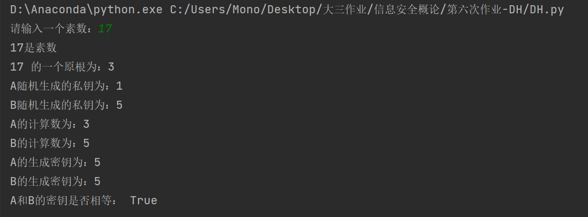
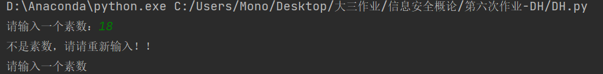

# DH密钥协商协议

## 算法描述

DH全称是Diffie-Hellman密钥协商算法主要解决秘钥配送问题，算法的主要流程如下：

以Alice和Bob为角色

1. 首先Alice与Bob共享一个素数pp以及该素数p的本原根g（geneator）2<=g<=p-1
2. Alice产生一个随机数XA [2,p-1]然后计算 g ^ XA mod p = YA将YA发给Bob
3. Bob产生一个随机数XB [2,p-1]然后计算 g ^XB mod p = YB将YB发给Alice
4. Alice将拿到的YB^XA mod p = KA得到密钥KA
5. Bob将拿到的YA^XB mod p = KB得到密钥KB
6. 数学证明可得KA=KB=g^(XA*XB) mod p 由此实现秘钥配送

**生成元g的获取**

1. 先判断g与p是否互质，利用gcd(p,g)==1判断互质
2. 如果互质接着判断g^e mod p == 1是否当且仅当e == p-1时成立
3. 同时满足上述条件可以获得生成元g

## 代码实现

```python
# 判断n是素数
def isPrime(p):
    # 素数的判断
    if p <= 1:
        return False
    i = 2
    while i * i <= p:
        if p % i == 0:
            return False
        i += 1
    return True

# 求最大公约数
def gcd(p, g):
    if g!=0:
        return gcd(g, p % g)
    else:
        return p

# 返回p的一个生成元 无则返回-1
def get_generator(p):
    # 得到所有的原根
    a = 2
    while a < p:
        if gcd(p,a) != 1 :
            continue
        flag = 1
        while flag != p:
            if (a ** flag) % p == 1:
                break
            flag += 1
        if flag == (p - 1):
            return a
        a += 1
    return -1

def exp_mod(b,n,m):
    return (b ** n) % m
```


## 算法测试

输入素数17



输入非素数18

